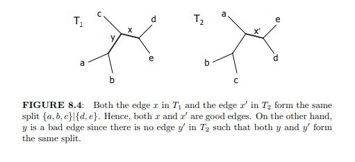
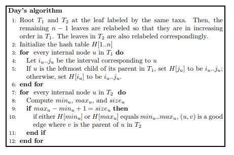
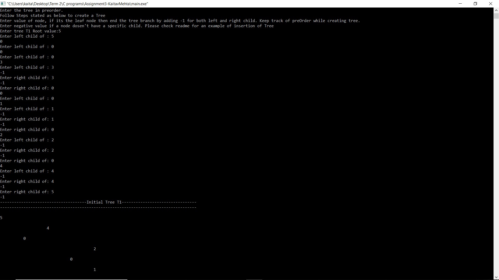

### The goal of this repository is to implement Days Alogrithm in C to find Robinsons Fold Distance 

# Robinson Fold's Distance

 
Consider two unrooted trees T1 and T2. An edge x in T1 is called a good
edge if there exists an edge x in T2 such that both of them form the same
split. Otherwise, the edge x is called a bad edge. Note that, by definition,
every leaf edge is a good edge. Figure 8.4 illustrates an example.

  

Given two phylogenetic trees T1 and T2, the Robinson-Foulds (RF) distance
between T1 and T2 is half the sum of the number of bad edges in T1 with
respect to T2 and that in T2 with respect to T1. For example, in Figure 8.4,
there is only one bad edge in each phylogenetic tree. By definition, the RF
distance is (1 + 1)/2 = 1.

Days Algorithm

    
## Input Guide:
There are two ways user can test this program 1) Default Tree Input 2) Manual Tree Input

User can test the program on default Tree Input by Pressing 1 at the beginning of the run.
## Default Trees:

Robinson Fold Distance for the above Tree is 1. 
## Manual Tree Input:
User can test the program on default Tree Input by Pressing 0 at the beginning of the run.
Below steps are mentioned to create above tree T1 manually. Follow Similarly to create any other tree where you want to calculate Robinson Fold’s Distance.
1.	The Tree is created in Preorder Insertion. 
2.	For empty node 0 is used.
3.	Enter value of node, if its the leaf node then end the tree branch by adding -1 for both left and right child. Keep track of preOrder while creating tree.
4.	Enter negative value if a node doesn’t have a specific child
Below is the Input order for Tree T1. Similarly add the tree T2. 
And check the Robinson Fold Distance. 

